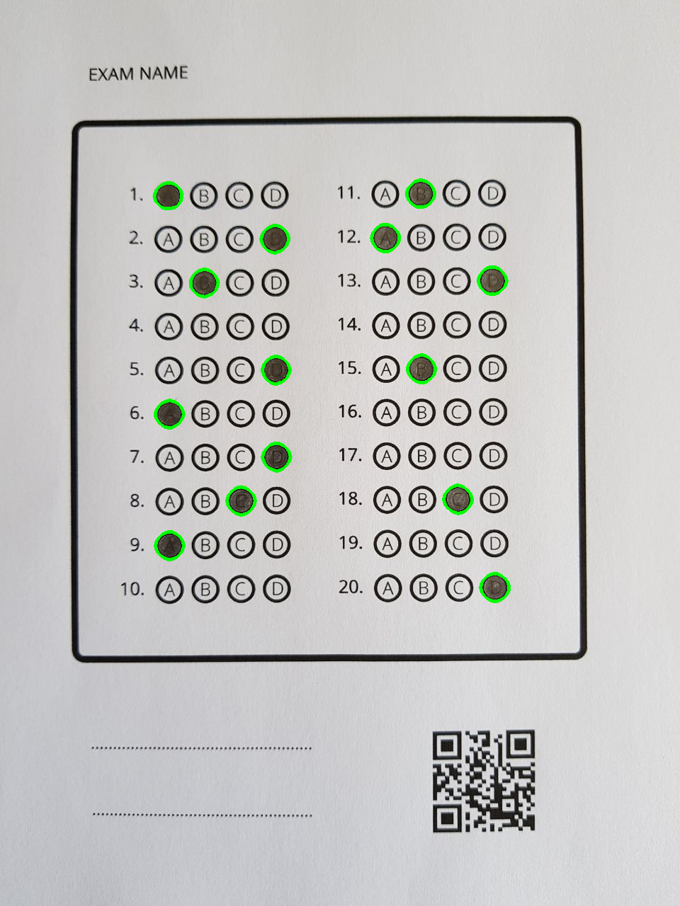

# Bubble Sheet Multiple Choice Scanner

Bubble sheet multiple choice scanner example with OpenCV Java.

## Install

Download OpenCV from [offical site](https://opencv.org/releases.html). After then add library to project and set VM options as following.

``` 
// native library path 

-Djava.library.path=/opencv/build/lib
```

### Intellij

``` 
File > Project Structure (Ctrl + Alt + Shift + S) > Libraries > + (Alt + Insert) > Select OpenCV jar file 

Run/Debug Configuration -> Application -> VM options
```

## Steps

* Dilate source image for better recognition
* Transform to Grayscale format
* Threshold operation (for recognizing mask/conjuction with bitwise_and)
* Blur filter
* Canny edge algorithm
* Adaptive Thresh (for find main wrapper rectangle & bubbles)
* Recognize main wrapper rectangle according to hierarchy
* Find bubbles with estimated ratio (~17/15.5)
* Sort bubbles by coordinate points
* Recognize which option is filled or empty with bitwise_and and countNonZero

## Sources

* Pdf - Bubble Sheet Form
* Inputs - Example Sheet 1 & 2
* Outputs for Sheet 1 & 2

## Running

Run the "main" method of Main class.

```
    public static void main(String[] args) throws Exception {

        sout("...started");

    (1) Mat source = Imgcodecs.imread(getSource("sheet-1.jpg"));

        Scanner scanner = new Scanner(source, 20);
    (2) scanner.setLogging(true);
        scanner.scan();

        sout("...finished");
    }
```

(1) change source file name

(2) if logging is 

* enabled, you can see processing flow and some detailed logs.

* disabled, you can see only output/result file.

## Output (for sheet-2)

```
...started
*************************************
*************************************
answer is ....
*************************************
*************************************
1. A
2. D
3. B
4. EMPTY/INVALID
5. D
6. A
7. D
8. C
9. A
10. EMPTY/INVALID
11. B
12. A
13. D
14. EMPTY/INVALID
15. B
16. EMPTY/INVALID
17. EMPTY/INVALID
18. C
19. EMPTY/INVALID
20. D
...finished
```


